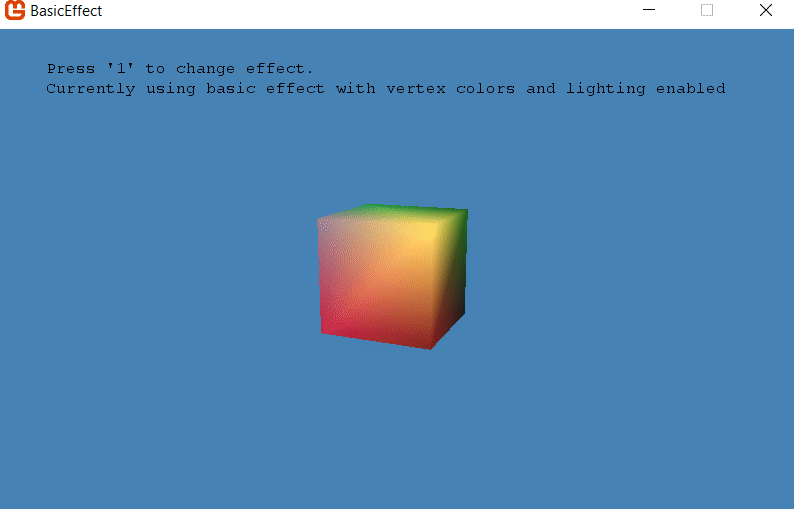

# Basic Effect example

Shows off the power of the `BasicEffect` class provided by MonoGame.

This example if inspired by the [Creating a Basic Effect](https://msdn.microsoft.com/en-us/library/bb203926.aspx) example from MSDN.
