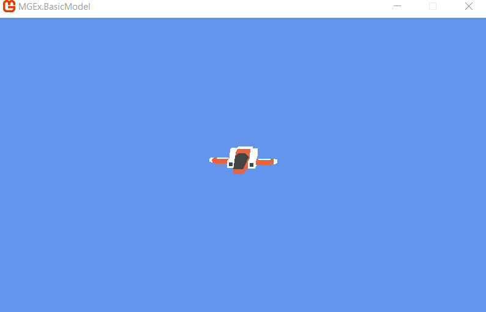

# Basic Model example

Renders a 3D spaceship with an orbiting camera. The spaceship is created by Kenney (www.kenney.nl).

This example is somewhat inspired by the [Rendering a Model with a Basic Effect](https://msdn.microsoft.com/en-us/library/bb203933.aspx) example from MSDN.
